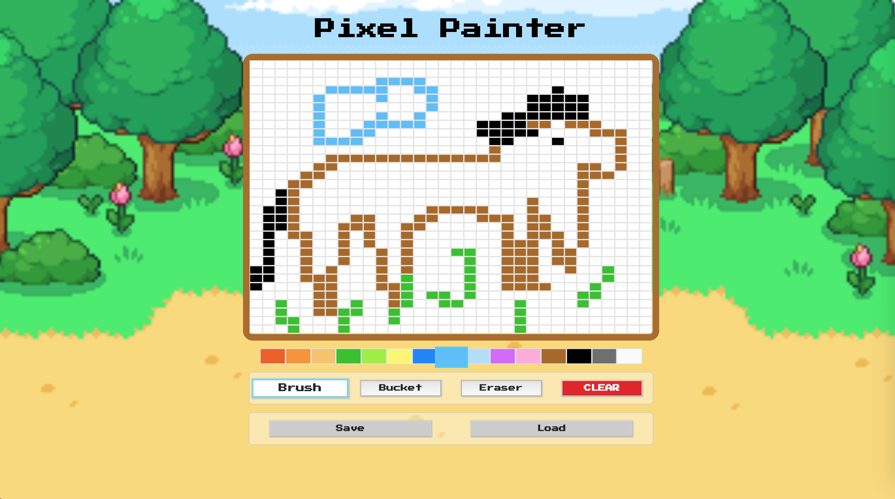

# Reverse Tic-Tac-Toe

A pixel paint web application written in pure vanilla Javascript.

## Features

- Single save state (with Local Storage)
- Fill bucket functionality using scanline algorithm
- Click & Drag paint

## How to play?

You can play with a demo-version here: [Demo](https://reverent-neumann-e98a03.netlify.com)

## Screenshots

